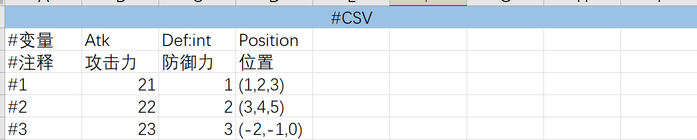
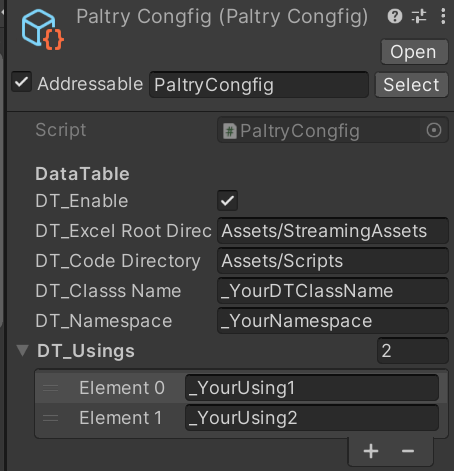

# DataTable

该工具可将Excel数据生成代码,例如,如下的Excel表将生成这样的代码:



```C#
using UnityEngine;
	public class _YourDTClassName
	{
		public static _TestDataBook TestData => instance._TestData;

		private static _YourDTClassName instance = new();
		private _TestDataBook _TestData = new();

		public class _TestDataBook
		{
			public readonly Sheet4Entry[] Sheet4 =
			{
				new(21,1,new Vector3(1f,2f,3f)),
				new(22,2,new Vector3(3f,4f,5f)),
				new(23,3,new Vector3(-2f,-1f,0f)),
			};
			/// <param name="Atk">攻击力</param>
			/// <param name="Def">防御力</param>
			/// <param name="Position">位置</param>
			public record Sheet4Entry
			(
				int Atk,
				int Def,
				Vector3 Position
			);
		}
	}
```

可以直接通过表格里的字段名访问数据,并且不需要反序列化等操作

## Excel数据表语法

1. **表格类型** 首行第一格写#CSV或#KVP,前者表示表格,后者表示都是键值对(类似Dictionary)
2. 对于CSV,在第二三行的第一列写#变量和#注释,两者顺序可互换,前者是代码里的标识符,后者是注释,数据从第四行开始且第一列从#1开始递增
3. 对于KVP,在第二行的第一二列写#变量和#注释,两者顺序可互换,前者是代码里的标识符,后者是注释,数据从第二行第三列以#1开始,后续数据往下按行写
4. **#变量** 标识符[:类型] 若省略类型,将自动推断
5. **类型推断** 可推断类型有:基元类型(int,float,string等)和Unity的Vector2,Vector3,Quaternion,以及这些类型的数组和二维数组,类型推断是根据第一个数据来判断的(例如上图的Atk字段将根据"21"推断为int)
6. **数据语法** ***int***:数字  ***float***:数字,第一个数据必须带上小数点否则认为是int  ***char***:用<''>括起来  ***string:*** 用<"">括起来,若字符串包含双引号"或方括号[]需用<\\>转义 ***bool:*** true或false ***Vector2:*** (a,b)的形式,***Vector3和Quaternion同理:*** (a,b,c)和(a,b,c,d)
   ***数组:*** 用<[]>方括号包起来,元素之间以逗号分隔,数组可嵌套数组(最多二维),例如以下都是合法的:

   ```
   [1,2,3] //int[]
   [(1,3,5),(3,4,5)] //Vector3[]
   [["Arr1_1","Arr1_2"],["Arr2_1","Arr2_2","Arr2_3"]] //string[][],由于使用交错数组,子数组长度可以不同
   ```
7. **自定义类型** 对于无法推断的类型,必须在#变量行(列)写出类型(以<:>冒号分隔),在全局命名空间及UnityEngine的类型可直接写类型名,否则需带上命名空间全名,也可以在Paltry/Config配置文件里添加using,避免写全名
8. **添加自定义类型** 在Paltry/Config/Custom_DT_Parser里可添加自定义类型,只有在此处添加的类型才能被正确解析,且自定义类型无法被推断,必须在#变量行(列)写出类型

   ## 使用

   **配置**: 如下图,在Paltry/Coofig依次填入:**启用DT模块**,**Excel根目录路径**(该目录内,以及其所有子目录内的Excel都会被导入,在读取后会在原地生成副本,这样可以在编辑Excel同时读取它),**数据表代码生成路径,** **数据表类名,** **数据表类所在的命名空间** (可不填,将位于全局命名空间), **using列表** (可不填,默认using UnityEngine)
   

完成配置并在Excel中填入数据后,运行即自动生成数据表类,该类的结构如下,**对其解释以#开头标出**

```C#
	public class _YourDTClassName
	{
		#TestData是Excel文件名.用于区分是哪一个.xlsx文件(以下称为Book)的表格,如果有多个Book,该字段也会对应生成
		public static _TestDataBook TestData => instance._TestData;

		#这两行都是内部字段,用于实现内部单例,这样可直接通过类名获取而不用再写.Instance
		private static _YourDTClassName instance = new();
		private _TestDataBook _TestData = new();

		#第一个Book,该Book含有4张sheet,分别名为Sheet1-4
		public class _TestDataBook
		{
			#CSV表通过数组的形式,即将表格里的一行(entry)作为一个元素,构成数组,通过下标获取到哪一行的元素,再根据字段获取对应属性
			public readonly Sheet1Entry[] Sheet1 = {
				new(3,11,@"小怪",new Vector3(5f,3f,6f),21.4f,new[]{1.0f,2f,3f,},true,new Quaternion(1f,3f,4f,5f)),
				new(-3114,3511,@"小怪234号",new Vector3(123.2f,0f,3.5f),32.4f,new[]{1f,2f,3f,3f,6f,0f,},false,new Quaternion(1f,3f,4f,5f)),
				new(-312134,75511,@"小怪567号",new Vector3(121.2f,0.73f,.01f),37.4f,new[]{1f,2f,5f,53f,2.2f,3f,3f,6f,0f,},false,new Quaternion(1f,3f,4f,5f)),
			};#数据是以数组初始化的形式填充,以下将省略

			#KVP表则是一个简单的实例,直接通过字段名访问
			public readonly Sheet2KVP Sheet2 = new();
			public readonly Sheet3Entry[] Sheet3 = { ...(数据) };
			public readonly Sheet4Entry[] Sheet4 = { ...(数据) };

			#CSV表的Entry定义,是一个record
			///注释...
			public record Sheet1Entry
			(
				int atk,
				int def,
				string name,
				Vector3 position,
				float Speed,
				float[] MyArr,
			);

			#KVP表的定义,字段在定义时赋初始值,故而直接new就能拿到数据
			public class Sheet2KVP
			{
				/// <summary> 攻击力  </summary>
				public readonly int atk = 3;
				/// <summary> 防御力 </summary>
				public readonly int def = 32;
				/// <summary> 名字 </summary>
				public readonly string name = @"name";
				/// <summary> 位置 </summary>
				public readonly Vector2 position = new Vector2(2f,3f) ;
				/// <summary> 路径列表 </summary>
				public readonly Vector2[] path = new[]{new Vector2(2f,95f),new Vector2(13f,4f),};
				/// <summary> 价格表 </summary>
				public readonly int[] prices = new[]{1,2,3,};
				/// <summary> 浮点数矩阵 </summary>
				public readonly float[][] floatMat = new[]{new[]{2.3f,4.6f,9.0f,},new[]{23f,4f,5.2f,},};
				/// <summary> 字符串矩阵 </summary>
				public readonly string[][] strMat = new[]{new[]{@"tes[t]1""",@"e",},new[]{@"""i.s}""",@"we",},};
			}
            ///注释...
            public record Sheet3Entry
			(
				int atk,
				int def,
				string name,
				Vector3 position,
				float Speed,
				float[] floats,
				string[][] strArray2
			);

            ///注释...
            public record Sheet4Entry
			(
				int Atk,
				int Def,
				Vector3 Position
			);

		}
	}
```

**使用示例**

```C#
using _YourNamespace;
record Enemy(int atk, int def, Vector3 position);
class Test : MonoBehaviour
{
    private void Start()
    {
        //创建表格里第一个敌人
        var(atk,def,pos) = _YourDTClassName.TestData.Sheet4[0];
        Enemy e = new(atk,def,pos);

        //筛选出攻击力大于10的单位
        foreach (var i in _YourDTClassName.TestData.Sheet3.Where(x => x.atk > 10))
            print(i);

        //获取敌人的名字
        var enemyName = _YourDTClassName.TestData.Sheet2.name;
    }
}

```

总之,通过类名.Book名.Sheet名就能拿到对应的表,如果感到代码太长,可将前面部分用一个变量存起来(如var book = _YourDTClassName.TestData;)
**注意**
1.表格里的Book和Sheet的类名和Excel文件里是一致的,所以请保证符合标识符规则(字母数字下划线,不以数字开头,可使用Unicode字符)
2. **导表时机** 仅在有任何表格发生改动(根据修改时间检测)时才会重新生成代码,这样可避免重复生成
3. 若表格有语法、格式错误或类型不存在等问题,将在控制台输出错误信息且不生成代码,需改掉错误后再次生成
