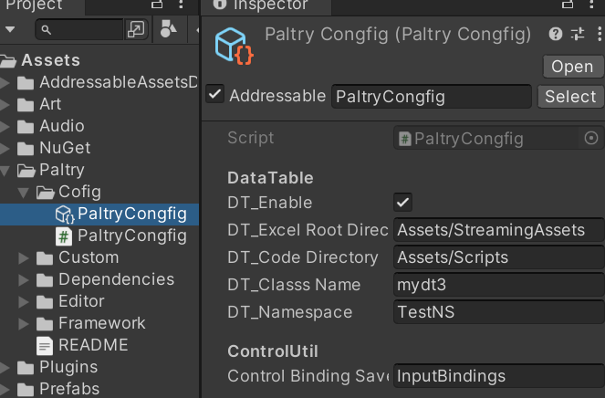

# Paltry文档

## 简介

用于Unity的游戏框架,集成了一些常用模块,功能较为基础,使用门槛较低

Unity版本: 2021.3.8f1c1

## 目录说明

**Config**: Paltry框架本身的配置文件(ScriptableObject),用来设置各个模块的参数,**需打包进Addressable中并简化名称**

若新项目想使用旧项目的配置,直接将图中配置文件替换并打包即可

**Custom**: Paltry框架的自定义部分,此部分是外部接口,框架会应用其中内容

同上,这部分在不同项目之间使用也只需要替换Custom文件夹下的代码

**Dependencies**: 框架用到的依赖,源码和dll包含在里面,不需要手动下载,若发现和你现有项目冲突,可以把该文件夹内的依赖删除

子目录Nuget_Packages是用[Nuget for Unity](https://github.com/GlitchEnzo/NuGetForUnity)下载的包,若你的项目也用到了该插件,可将该目录下的文件合并到插件的Package目录下

**Editor:** 编辑器相关代码(暂时为空)

**Framework:** 框架的核心代码,包含各个模块

## Get Started

点击右侧Releases,下载Paltry.unitypackage,导入Unity,并在场景中任意GameObject上挂载Paltry.MonoAgent脚本,便能正常使用了,

当然,你还需要在脚本里加上 `using Paltry;`

某些模块在使用前需要在Paltry.Config下进行配置,具体请参见对应模块介绍

## 模块介绍

### AudioMgr

*在Paltry/Config下可配置默认音频设置*

自动管理BGM和音效的缓存,并播放它们,音频设置可直接对接UI面板的音频设置(即在禁用音频时声音为0,切换回来时保持之前的值)

### EventCenter

基于观察者模式的事件中心,可以订阅和移除事件,支持带一个参数的事件(多个参数用值元组)

事件名建议定义在PaltryConst.EventName里,避免硬编码

### ControlUtil

*在Paltry/Config下可配置按键绑定信息的文件路径*

结合InputSystem使用,可便捷地切换ActionMap以及改键,改键时可找出重复按键

### MonoAgent

**确保该脚本挂载在物体上**

管理Mono相关,不继承Mono的类可以在这里执行Update等方法,并且它负责确保在禁用域重载后

单例对象正常初始化(而不是保持先前状态)

### Pool

有两种Pool:GoPool用于GameObject,会自动把不同种类的GameObject分组,便于管理

Pool<T\>则是通用的对象池,能用于任何对象,只需提供相应的工厂方法和事件函数即可

对象池使用前需要Warm暖池,即初始化,之后直接通过Get得到实例对象就能用了

### ResourcesLoad

对Addressable的一层封装

### Singleton

支持C#单例(不继承Mono),Mono单例(继承Mono),ScriptableObject单例,PersistentDataMap单例(保存持久化数据所用)

### Storage

保存和加载数据到本地,通常与上面的PersistentDataMap单例一同使用

### Timer

计时器,包括不受时间缩放影响的,用法和StopWatch差不多

### UIFramework

*Canvas和EventSystem应通过Addressable打包*

提供了便捷的打开/关闭面板方法,将UI面板按栈管理

会缓存加载过的UI资源,如果想进一步缓存,可设置面板的缓存策略为Open

也可以彻底清除面板,不常用,一般是内存很紧张时才用

自带UIPanel淡入淡出效果

还有UI动画组件,只需在UI面板的脚本里通过扩展方法添加组件并应用效果即可

### DataTable

导表工具,可将Excel表格数据生成为代码,方便使用,请参阅[DataTable.md](./DataTable/DataTable.md)
